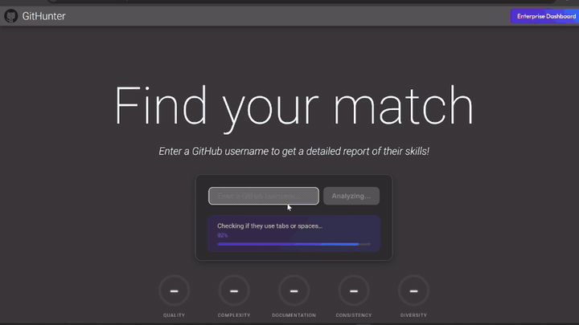

# GitHunter

> AI-powered GitHub profile analyzer for recruiters and developers

**[▶ Live demo](https://git-hunter-nu.vercel.app/)** · **[Full walkthrough](https://github.com/user-attachments/assets/d8d318c7-d034-4e95-a8eb-225ffc930945)**



GitHunter takes any GitHub username and generates a comprehensive hiring-grade report, with AI scoring, code quality analysis, strengths/weaknesses, technical highlights, and exportable PDF or Google Slides presentations.

---

## Table of Contents

- [Features](#features)
- [Architecture Overview](#architecture-overview)
- [Tech Stack](#tech-stack)
- [Prerequisites](#prerequisites)
- [Installation](#installation)
- [Configuration](#configuration)
- [Running the App](#running-the-app)
- [API Reference](#api-reference)
- [Hosting Guide](#hosting-guide)
- [Testing](#testing)
- [Project Structure](#project-structure)

---

## Features

- **GitHub Profile Analysis** — Fetches user data, repositories, commits, pull requests, stars, forks, and pinned repos via the GitHub REST and GraphQL APIs.
- **AI Scoring (Gemini)** — Scores candidates across five weighted categories: Code Quality, Project Complexity, Documentation, Consistency, and Technical Breadth. Powered by Google Gemini.
- **Job Description Matching** — Paste a job listing and the AI re-weights its scoring criteria to match what that role actually needs.
- **Dual View Modes** — Switch between a **Recruiter** view (hiring recommendation, overall fit) and a **Developer** view (technical deep-dive).
- **PDF Export** — Download a formatted report PDF for any analyzed profile.
- **Google Slides Export** — Generate a shareable presentation from any report via the Google Slides API.
- **Enterprise Portal** — A dashboard listing all archived candidate reports (backed by Supabase), with one-click navigation to any profile report.
- **Redis Caching** — Reports and job statuses are cached in Redis to avoid redundant API calls. Gracefully falls back to direct API calls if Redis is unavailable.
- **Job Queue** — Analysis jobs are queued via Bull (Redis-backed) so the frontend can poll for progress without blocking.

---

## Architecture Overview

```
┌──────────────────────────────────────────┐
│              Frontend (HTML/JS)          │
│  interface.css · script.js               │
│  ReportView.html · EnterpriseView.html   │
└────────────────┬─────────────────────────┘
                 │ HTTP (REST)
┌────────────────▼─────────────────────────┐
│           Backend (Node/Express)         │
│  POST /api/analyze   → enqueue job       │
│  GET  /api/status/:jobId                 │
│  GET  /api/report/:jobId                 │
│  GET  /api/download/:jobId  (PDF)        │
│  POST /api/slides/generate               │
│  GET  /api/enterprise/list               │
└──────┬───────────────┬───────────────────┘
       │               │
┌──────▼──────┐  ┌─────▼──────────────────┐
│    Redis    │  │     External APIs      │
│ Job Queue   │  │  GitHub REST + GraphQL │
│ Report Cache│  │  Google Gemini AI      │
└─────────────┘  │  Google Slides API     │
                 │  Supabase (archive)    │
                 └────────────────────────┘
```

---

## Tech Stack

| Layer | Technology |
|---|---|
| Frontend | Vanilla HTML, CSS, JavaScript, Chart.js |
| Backend | Node.js, Express 5 |
| AI Analysis | Google Gemini (`gemini-3-flash-preview`) |
| Job Queue | Bull + Redis |
| Caching | Redis (ioredis) |
| PDF Generation | PDFKit |
| Slides Export | Google Slides API (OAuth or Service Account) |
| Long-term Archive | Supabase (PostgreSQL) |
| Testing | Jest, Supertest |

---

## Prerequisites

- **Node.js** v18 or later
- **npm** v9 or later
- **Redis** (local or hosted — e.g. Redis Cloud, Upstash)
- **GitHub Personal Access Token** *(optional but strongly recommended — raises rate limit from 60 to 5,000 req/hour)*
- **Google Gemini API key** — for AI scoring ([get one here](https://aistudio.google.com/apikey))
- **Google OAuth credentials** *(optional)* — for Google Slides export
- **Supabase project** *(optional)* — for the Enterprise archive portal

---

## Installation

### 1. Clone the repository

```bash
git clone https://github.com/your-username/GitHunter.git
cd GitHunter
```

### 2. Install backend dependencies

```bash
cd backend
npm install
```

### 3. Configure environment variables

```bash
cp .env.example .env
```

Edit `.env` with your credentials — see [Configuration](#configuration) below.

### 4. Start Redis

If running Redis locally:

```bash
redis-server
```

Or point `REDIS_URL` at a hosted Redis instance. The app runs without Redis but loses caching and the job queue.

---

## Configuration

All configuration lives in `backend/.env`. Copy `backend/.env.example` and fill in the values:

```env
# GitHub (optional — increases rate limit from 60 to 5,000 req/hour)
# Create at: https://github.com/settings/tokens
GITHUB_TOKEN=your_token_here

# Redis (required for job queue and caching)
REDIS_URL=redis://localhost:6379

# Cache TTL in seconds (default: 1 hour)
REPORT_CACHE_TTL=3600

# Google Gemini API key (required for AI analysis)
# Get one at: https://aistudio.google.com/apikey
GEMINI_API_KEY=your_api_key_here

# --- Google Slides (optional) ---
# OAuth is recommended for personal use (no Workspace required)
# See backend/docs/GOOGLE_SLIDES_OAUTH_SETUP.md for setup instructions
GOOGLE_OAUTH_CLIENT_ID=
GOOGLE_OAUTH_CLIENT_SECRET=
GOOGLE_OAUTH_REFRESH_TOKEN=

# Optional: clone this Drive file as the slide template
# SLIDES_TEMPLATE_ID=

# Optional: save generated slides to this Drive folder
# SLIDES_DRIVE_FOLDER_ID=

# How long (ms) before deleting the server's copy of the presentation (default: 5 min)
# SLIDES_CLEANUP_DELAY_MS=300000

# --- Supabase (optional — for Enterprise portal) ---
# Create a project at https://supabase.com
# See backend/docs/SUPABASE_SETUP.md for table schema
SUPABASE_URL=https://<your-project-ref>.supabase.co
SUPABASE_SECRET_KEY=sb_secret_...
```

---

## Running the App

### Start the backend

```bash
cd backend
npm start
# Server running on port 5000
```

The server defaults to port **5000**. Override with `PORT=3000 npm start`.

### Open the frontend

Open `frontend/ReportView.html` directly in your browser, or serve the `frontend/` directory with any static file server:

```bash
# Using Python's built-in server
cd frontend
python3 -m http.server 8080
# Visit http://localhost:8080/ReportView.html
```

> **Note:** The frontend's `API_BASE` is hardcoded to `http://localhost:5000` in `script.js`. Update this if your backend runs on a different host or port.

---

## API Reference

All routes are prefixed with `/api`.

### Analyze a GitHub profile

```
POST /api/analyze
Content-Type: application/json

{
  "username": "torvalds",
  "view": "recruiter",           // "recruiter" (default) | "developer"
  "jobDescription": "..."        // optional: paste a job listing to tune scoring weights
}
```

**Response:** `202 Accepted` → `{ "jobId": "42" }`

---

### Poll job status

```
GET /api/status/:jobId
```

**Response:** `{ "status": "queued|processing|completed|failed", "progress": 0-100 }`

---

### Fetch completed report

```
GET /api/report/:jobId
```

Returns the full report including:
- `report` — GitHub user data and repository stats
- `scores` — overall and per-category scores (0–100)
- `scoreBreakdown` — plain-English explanation of the score
- `strengthsWeaknesses` — strengths and weaknesses arrays
- `technicalHighlights` — notable frameworks, patterns, and repos
- `improvementSuggestions` — actionable improvement items
- `hiringRecommendation` — final hire/no-hire recommendation

---

### Fetch latest report by username

```
GET /api/report/latest/:username
```

Returns the most recently cached report for that username.

---

### Download PDF report

```
GET /api/download/:jobId
GET /api/download/latest/:username
```

Returns a `Content-Disposition: attachment` PDF response.

---

### Generate Google Slides presentation

```
POST /api/slides/generate
Content-Type: application/json

{ "username": "torvalds" }
```

**Response:** `{ "url": "...", "copyUrl": "...", "presentationId": "..." }` — open `copyUrl` to save a copy to your Drive.

---

### Enterprise portal

```
GET /api/enterprise/list
```
Returns `[{ username, score, avatar_url }]` for all archived reports in Supabase.

```
GET /api/enterprise/ensure/:username
```
Ensures a report is in Redis (loads from Supabase if missing).

---

## Hosting Guide

### Option 1 — Local development (quickest)

Follow the [Installation](#installation) steps above. This is best for testing and personal use.

---

### Option 2 — Railway (recommended for easy cloud hosting)

[Railway](https://railway.app) can host both the Node.js backend and a Redis instance for free (within usage limits).

1. Push your code to a GitHub repository.
2. Create a new Railway project → **Deploy from GitHub repo**.
3. Add a **Redis** plugin from the Railway dashboard — Railway will automatically inject `REDIS_URL` into your environment.
4. Add environment variables (all the values from your `.env`) under **Variables** in the Railway service settings.
5. Set the **Start Command** to `node index.js` and the **Root Directory** to `backend/`.
6. For the frontend, deploy the `frontend/` folder to a static host (see below) and update `API_BASE` in `script.js` to point to your Railway backend URL.

---

### Option 3 — Render

1. Create a **Web Service** on [Render](https://render.com), connect your repo, and set:
   - **Root Directory:** `backend`
   - **Build Command:** `npm install`
   - **Start Command:** `node index.js`
2. Add a **Redis** instance from Render's dashboard and copy the connection string into the `REDIS_URL` environment variable.
3. Add all other environment variables in the Render dashboard under **Environment**.
4. Deploy the `frontend/` folder to **Render Static Site** or any static host, and update `API_BASE` in `script.js`.

---

### Option 4 — VPS / DigitalOcean / EC2

1. SSH into your server and install Node.js 18+ and Redis.
2. Clone the repo and run `npm install` in `backend/`.
3. Create `/etc/systemd/system/githunter.service`:

```ini
[Unit]
Description=GitHunter Backend

[Service]
WorkingDirectory=/path/to/GitHunter/backend
ExecStart=/usr/bin/node index.js
Restart=always
EnvironmentFile=/path/to/GitHunter/backend/.env

[Install]
WantedBy=multi-user.target
```

4. Enable and start the service:

```bash
sudo systemctl enable githunter
sudo systemctl start githunter
```

5. Use **Nginx** as a reverse proxy to expose port 5000 on port 80/443, and serve the `frontend/` directory as a static site.

---

### Hosting the frontend

The frontend is plain HTML/CSS/JS — no build step required. Options:

| Host | Steps |
|---|---|
| **GitHub Pages** | Push `frontend/` to a `gh-pages` branch or configure Pages to serve from `frontend/` |
| **Netlify** | Drag and drop the `frontend/` folder at netlify.com/drop |
| **Vercel** | `vercel --cwd frontend` |
| **Nginx / Apache** | Copy `frontend/` to your web root |

**Important:** After deploying the backend, update `API_BASE` at the top of `frontend/script.js` to your backend's public URL:

```js
const API_BASE = "https://your-backend.railway.app"; // ← update this
```

---

### Optional: Supabase setup (Enterprise portal)

1. Create a project at [supabase.com](https://supabase.com).
2. Follow `backend/docs/SUPABASE_SETUP.md` to create the `archived_reports` table.
3. Add `SUPABASE_URL` and `SUPABASE_SECRET_KEY` to your environment.

### Optional: Google Slides setup

Follow `backend/docs/GOOGLE_SLIDES_OAUTH_SETUP.md` to obtain OAuth credentials, then set:

```env
GOOGLE_OAUTH_CLIENT_ID=...
GOOGLE_OAUTH_CLIENT_SECRET=...
GOOGLE_OAUTH_REFRESH_TOKEN=...
```

---

## Testing

```bash
cd backend

# All tests
npm test

# Unit tests only
npm run test:unit

# Integration tests (requires running backend)
npm run test:integration

# Cache integration tests (requires Redis)
npm run test:cache:integration

# v2 suite (AI analysis, Redis, Slides, user routes)
npm run test:v2
```

---

## Project Structure

```
GitHunter/
├── backend/
│   ├── index.js                   # Entry point — loads env, starts server
│   ├── package.json
│   ├── .env.example
│   ├── docs/
│   │   ├── GOOGLE_SLIDES_OAUTH_SETUP.md
│   │   └── SUPABASE_SETUP.md
│   ├── scripts/
│   │   ├── obtain-google-oauth-token.js   # One-time OAuth token helper
│   │   └── diagnose-slides-config.js      # Slides config debugger
│   ├── src/
│   │   ├── index.js               # Express app setup, CORS, route mounting
│   │   ├── config/
│   │   │   └── env.js             # Centralised environment config + defaults
│   │   ├── routes/
│   │   │   ├── analyze.js         # POST /api/analyze, GET /api/status, /report, /download
│   │   │   ├── user.js            # GET /api/user/:username
│   │   │   ├── matchmaker.js      # GET /api/matchmaker
│   │   │   ├── slides.js          # POST /api/slides/generate
│   │   │   └── enterprise.js      # GET /api/enterprise/list|ensure
│   │   ├── services/
│   │   │   ├── aiService.js       # Gemini prompt building + scoring + normalisation
│   │   │   ├── githubService.js   # GitHub API calls, report building, repo sorting
│   │   │   ├── githubApi.js       # Axios instance with GitHub auth headers
│   │   │   ├── analysisService.js # Orchestrates GitHub → AI → cache pipeline
│   │   │   ├── overviewService.js # Per-repo README, commits, pull requests
│   │   │   ├── pdfService.js      # PDFKit report generation
│   │   │   ├── slidesService.js   # Google Slides presentation generation
│   │   │   └── archiveService.js  # Supabase read/write for report archive
│   │   ├── utils/
│   │   │   ├── cache.js           # Redis connection + report/job status helpers
│   │   │   ├── queue.js           # Bull job queues (analysis + cleanup)
│   │   │   └── codeParser.js      # Code file utilities
│   │   ├── workers/
│   │   │   └── analysisWorker.js  # Bull worker — processes analysis jobs
│   │   └── codeSource/
│   │       ├── apiSource.js       # Fetches code samples from GitHub repos
│   │       └── index.js
│   └── tests/
│       ├── v1/                    # Unit + integration tests
│       └── v2/                    # AI analysis, Redis, Slides, route tests
└── frontend/
    ├── ReportView.html            # Main search + report UI
    ├── EnterpriseView.html        # Enterprise candidate portal
    ├── script.js                  # All frontend logic (search, polling, rendering)
    ├── interface.css              # Styles
    └── res/                       # Icons and logo assets
```

---

## License

ISC
